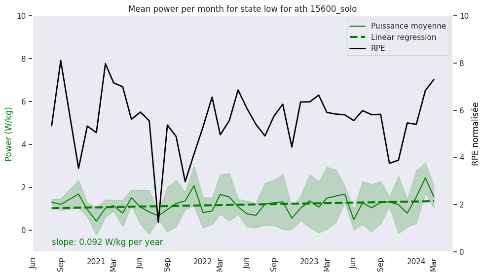
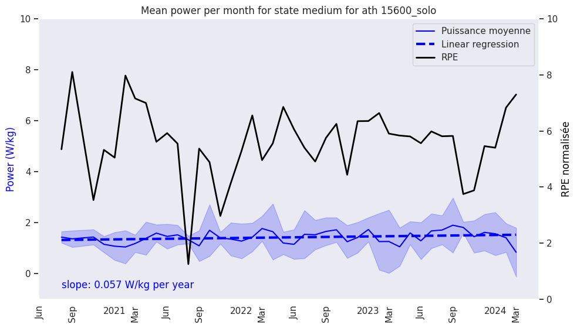
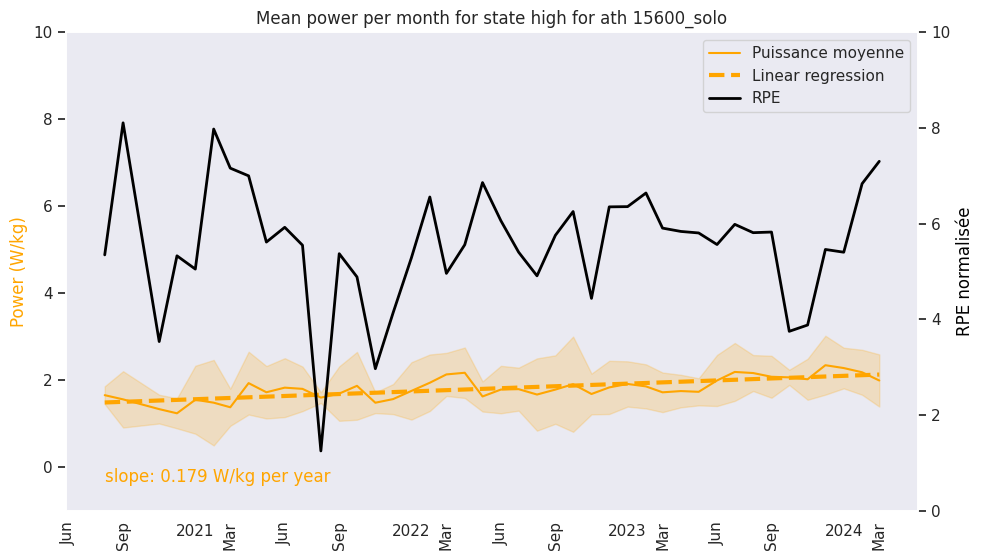
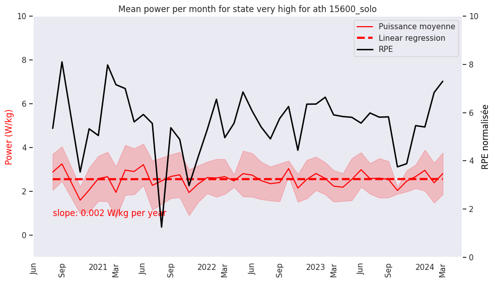
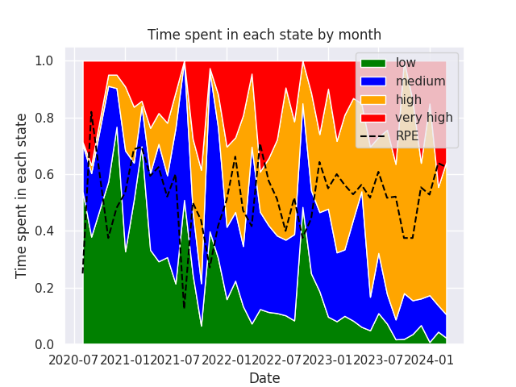
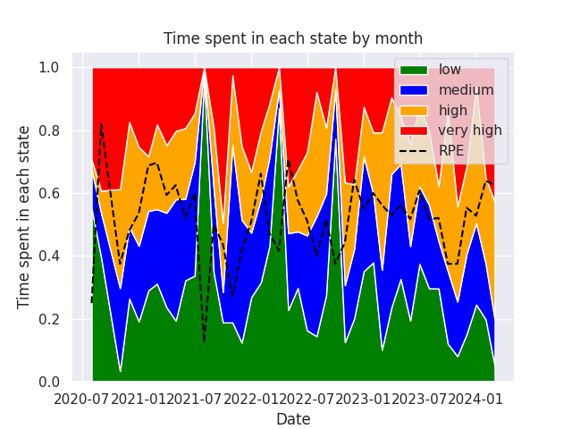

[French Version](Readme.md)
# TODO:
- Implement the power state pipeline.
- Check that there is no personal information in the notebooks.

# Internship Idea
The goal is to use athletes' training data to define a fitness level over time. The idea is to show and quantify progress from one session to another. The approach involves predicting RPE (Rate of Perceived Exertion) from session power data. RPE is a subjective measure of effort intensity used to quantify an athlete's perceived exertion level. The deep learning model used is an LSTM + RESNET to predict RPE from session power data, using the latent space as a representation of the athlete's fitness.

# Functionality
Two main steps are necessary to achieve this:
1. Transforming raw per-second session data into normalized per-session data for longitudinal tracking. The approach here is to define power zones using hidden Markov models and calculate the time spent in each power zone per session.
2. Training a recursive machine learning model with a latent space representing the athlete's fitness. The model is an LSTM + RESNET that takes normalized power data per session as input and predicts the RPE.

# Results
## Evolution of the mean power in each HR state

## Time spent in each power state over the years

## Time spent in each HR state over the years

# Repository Description

- `lstm_code`: Python code for training and predicting an LSTM + RESNET model to predict RPE from session power data.
- `notebooks`: Contains many test notebooks, mainly `clean_prod.ipynb`, `script_plot.ipynb`, and `vis_pres.ipynb`.
- `utils`: Contains utility functions for data processing and model creation. If some functions do not work, it is probably due to file relocation, notably for normalization and data formatting.
- `script_hmm`: Contains code for training and predicting a hidden Markov model (HMM) for power zone detection. `hmm_script.py` is the main script for training and prediction, while `hmm_plot.py` is used for visualizing results.
- `test`: Contains test files for functions in the `utils` directory.
- `pres`: Contains project presentation files, slides, and figures.

# Data Formatting for Model Training and Column Names

- **Cleaned columns**: `id_session`, `tps`, `stream_watts`, `stream_heartrate`, `date`, `ath_id`
- **Meta_data columns**: `id_session`, `poids`, `date`, `rpe`, `sport`, `ath_id`, `id` (which is `ath_id*1000000+id_session`)
- **Normalized columns**: `id_session`, `tps`, `stream_watts`, `stream_heartrate`, `date`, `rpe`, `sport`, `ath_id`, `id`
- **norm_data**: `id_session`, `ppr`, `ma_hr`, `roll_std_hr`, `rpe`, `date`, `sport`
- **Sport categories**: `['Vélo - Route', 'Vélo - Home Trainer', 'Vélo - Piste', 'Vélo - CLM']`

# Internship Steps
1. **Sports Science Bibliography**: Research on critical power models, power laws, injury prediction, statistical models, energy pathways, etc.
2. **Machine Learning Bibliography**: Study of LSTM, RESNET, HMM, Transformers, SSM, etc.
3. **Data Exploration and Preprocessing**.
4. **Consideration of Muscular Efficiency**: Ratio of useful energy for movement versus energy expended by the body, with the objective of quantifying it throughout the effort.
5. **Power Profile Per Session**: Attempt to compare sessions using power profiles, but this only describes maximum power outputs without providing information on the number of times they were performed (e.g., in interval training).
6. **Power Zones Based on PPR and Classic Effort Durations**: Attempt to classify efforts (endurance, threshold, sprint), but this approach performs poorly since time thresholds vary significantly among athletes.
7. **Using HMM for Power Zones**: Define power zones and calculate time spent in each zone per session. Also used on cardiac power to estimate mean power in each heart rate zone per session and its evolution.
8. **Training LSTM + RESNET for RPE Prediction**: Predict RPE from normalized session power. Considerable time spent optimizing hyperparameters and cost functions. The model performs well on training data but poorly on test data, indicating potential overfitting. The reasoning might be flawed because the model attempts to optimize the network while simultaneously discovering the hidden state representing the athlete's fitness, only supervised by session RPE. There might be missing information on training conditions.
9. **Evaluating Poor Training Sessions**: The model was intended to identify particularly poor training sessions (not accounting for sleep, recovery, etc.), but how can one determine if the model is incorrect or if the athlete is underperforming?

